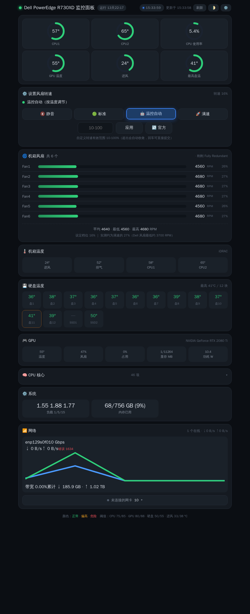
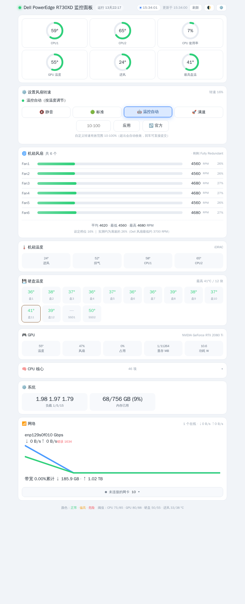

# DELL 服务器监控面板

[](LICENSE)
[](https://github.com/pengx001/dell-server-panel/releases)
[](https://github.com/pengx001/dell-server-panel/pkgs/container/dell-server-panel)
[](#)
[](#)
[](https://github.com/pengx001/dell-server-panel/stargazers)

**中文** | [English](README.en.md)


一个**单文件、零依赖**的服务器硬件监控面板：CPU 温度与负载、GPU 温度/风扇/显存/功耗、
机箱与硬盘温度、风扇转速、网卡状态与实时流量，并在 **Dell PowerEdge 服务器**上支持
**IPMI 风扇调速**（静音 / 标准 / 满速 / 温控自动，含高温自动兜底）。

> 后端纯 Python 标准库，前端单个 HTML（无框架、无 CDN）；数据全部本机读取，**不联网、不上传任何数据**。



> 上图取自真实运行中的 Dell R730XD（CPU 双路 / 6 风扇 / 14 硬盘 / 10G 网卡）。

---

## ✨ 特性

| 模块 | 说明 |
|---|---|
| 🧠 **CPU** | 每个核心 + 每个物理封装（多路 CPU 分别显示）温度 |
| 🎮 **GPU** | 温度 / 风扇转速 / 占用率 / 显存 / 功耗（NVIDIA；AMD/Intel 基础支持） |
| 🌀 **风扇** | 逐风扇转速 + 百分比条形 + 冗余状态；服务器走 IPMI，家用主板走 hwmon |
| 💾 **硬盘** | 逐盘温度（RAID 卡 / NVMe / 直连 SATA），最热盘高亮 |
| 🌡 **机箱** | 进风 / 排气 / 各 CPU 温度（IPMI） |
| 📶 **网络** | 网卡在线状态 / 链路速率 / 实时上下行 / 累计流量 / 错误计数 |
| ⚙️ **系统** | 负载、内存、运行时长 |
| 🔇 **风扇调速** | Dell IPMI：静音(10%) / 标准(20%) / 满速(100%) / 温控自动 / 自定义 % / 交还 iDRAC |
| 🛡 **安全兜底** | CPU ≥78°C 自动交还 iDRAC；转速下限 10%；面板带健康灯与阈值着色 |

**自动降级**：读到什么显示什么 —— 没有 GPU、没有 IPMI、没有 RAID 卡时，对应卡片自动隐藏，不会报错。

---

### 界面特性
- **标题自动跟随硬件**：标题由硬件型号自动生成（如「Dell PowerEdge R740 监控面板」）；也可用 `TITLE="{model} 监控面板"` 自定义
- **自动识别硬件型号**：启动即读 DMI，显示如「Dell Inc. · PowerEdge R730XD」的型号徽章，**换机器（如 R740）自动跟随**，无需改配置
- **环形进度仪表**：关键温度以圆环呈现，颜色随阈值变化（绿 → 黄 → 红）
- **卡片显示自定义**：右上角 ⚙️ 勾选要显示的卡片（本机记忆，可一键恢复默认）
- **深色 / 浅色主题**：右上角 🌓 切换，或用链接 `?theme=light` 直接进入浅色
- **实时时钟**：头部秒级时钟，悬停显示完整日期与星期
- **动效**：卡片依次淡入 · 数值变化平滑滚动 · 温度变化时卡片轻微闪烁
- **网络卡片**：在线网卡卡片化 + 实时带宽占用条 + **吞吐波形图**（近 150 秒），未连接网卡自动折叠
- 纯前端单文件实现（无框架 / 无 CDN），移动端适配，支持 `prefers-reduced-motion`

## 🚀 快速开始

### 方式一：docker compose（推荐）

```bash
git clone https://github.com/<你的用户名>/dell-server-panel.git
cd dell-server-panel
# 按需修改 docker-compose.yml 里的 IPMI 地址/账号/密码
docker compose up -d --build
```

打开 `http://<服务器IP>:18080`

### 方式二：docker run

```bash
docker run -d --name dell-server-panel \
  --network host --pid host --restart unless-stopped \
  -v /sys:/sys:ro \
  -e PORT=18080 \
  -e TITLE="DELL服务器监控面板" \
  -e IPMI_HOST=192.168.1.120 -e IPMI_USER=root -e IPMI_PASS=calvin \
  -e ENABLE_FAN_CONTROL=true \
  dell-server-panel:latest
```

### 方式三：不用 Docker（宿主机直接跑）

```bash
cd src
TITLE="DELL服务器监控面板" PORT=18080 python3 app.py
```
> 需安装 `ipmitool`、`smartmontools`；本地 IPMI 需要 root 或 `sudo` 免密。

### 方式四：用现成镜像（GitHub Actions 自动构建）

```bash
docker pull ghcr.io/<你的用户名>/dell-server-panel:latest
```

---

### 构建小贴士

- 若 `docker build` 报 **401/dial tcp** 之类拉取失败，先手动拉基础镜像再构建：
  ```bash
  docker pull python:3.12-slim
  docker build -t dell-server-panel .
  ```
- 容器内以 **root** 运行，本地 IPMI 会自动省去 `sudo`（宿主机普通用户运行时才需要 `sudo -n` 免密）。

### 已验证环境

| 环境 | 结果 |
|---|---|
| Docker + Dell R730XD（iDRAC 本地 IPMI + perccli 挂载） | ✅ CPU 2 路 / 风扇 6 / 硬盘 14 / 机箱 4 项 / 网卡 11，接口响应 ~0.013s |
| 宿主机直接运行（非 Docker） | ✅ 全量数据 |
| 无 IPMI / 无 RAID 卡环境 | ✅ 对应卡片自动隐藏（只显示可读项） |

## ⚙️ 环境变量

| 变量 | 默认 | 说明 |
|---|---|---|
| `PORT` | `8080` | 监听端口 |
| `BIND` | `0.0.0.0` | 监听地址 |
| `REFRESH` | `5` | 前端刷新间隔（秒） |
| `TITLE` | `DELL服务器监控面板` | 页面标题 |
| `IPMI_HOST` | 空 | **BMC/iDRAC 地址**；填写即用远程 IPMI（容器无需特权）|
| `IPMI_USER` / `IPMI_PASS` | `admin` / 空 | IPMI 账号 |
| `IPMI_INTERFACE` | `lanplus` | IPMI 接口（`lanplus`/`lan`）|
| `IPMI_LOCAL_SUDO` | `1` | 本地 IPMI 是否用 `sudo -n` |
| `ENABLE_FAN_CONTROL` | `auto` | `true`/`false`；`auto`=检测到可写 IPMI 才启用 |
| `FAN_TEMP_LIMIT` | `78` | 超过该温度自动交还 iDRAC |
| `AUTH_USER` / `AUTH_PASS` | 空 | HTTP Basic 访问密码（留空=不校验）|
| `PERCCLI` | 自动探测 | perccli/storcli 路径（读取 RAID 硬盘温度）|

也可用 `config.json`（放到容器 `/app/config.json` 或挂载 `/data`）覆盖，示例见 `config.example.json`。

---

## 🔧 硬件支持

| 项目 | 数据来源 | 需要条件 |
|---|---|---|
| CPU 温度 | `/sys/class/hwmon`（coretemp / k10temp / zenpower / cpu_thermal / it87…） | 挂载 `/sys:ro` |
| GPU | `nvidia-smi`（NVIDIA）/ amdgpu hwmon（AMD） | NVIDIA 需 `--gpus all` 或 `runtime: nvidia` |
| 风扇 / 机箱温度 | `ipmitool sdr`（服务器）或 `hwmon fan*_input`（家用主板） | 远程 IPMI 或 `--device /dev/ipmi0` |
| 硬盘温度 | `perccli`/`storcli`（RAID 卡）→ `nvme smart-log` → `smartctl`（直连盘） | RAID/直连盘需 `--privileged` + `-v /dev:/dev` |
| 网络 | `/proc/net/dev`（容器需 `network_mode: host`） | 已默认 |
| 风扇调速 | Dell IPMI raw（`0x30 0x30`） | iDRAC 账号可写 + `ENABLE_FAN_CONTROL=true` |

### NVIDIA GPU

```yaml
    runtime: nvidia          # 或 deploy.resources.reservations.devices
    environment:
      - NVIDIA_VISIBLE_DEVICES=all
```

### 硬盘温度（RAID 卡）

```yaml
    privileged: true
    volumes:
      - /dev:/dev
```
> 把宿主机的 `perccli`/`storcli` 放进镜像或挂载：`-v /usr/local/bin/perccli:/usr/local/bin/perccli:ro`

---

## 🔇 风扇调速（Dell PowerEdge）

| 按钮 | 效果 |
|---|---|
| 🔇 静音 | 固定 ~10%（Dell 最低安全转速） |
| 🟢 标准 | 固定 20% |
| 🤖 温控 | 按 CPU 温度自动（52/60/66/72/78°C → 10/12/16/25/40%）|
| 🚀 满速 | 固定 100%（前端二次确认） |
| 自定义 | 10~100%，低于 10% 自动钳制 |
| ↩️ 官方 | 交还 iDRAC 自动控制 |

**安全设计**：≥`FAN_TEMP_LIMIT`（默认 78°C）→ 立即交还 iDRAC；读不到温度 → 交还 iDRAC；
未配置 IPMI 或不可写 → 控制卡片自动隐藏（只读监控）。

---

## ❓ 常见问题

**Q: 风扇/机箱温度显示不出来**
A: 说明 IPMI 不可用。服务器请填写 `IPMI_HOST/USER/PASS`（远程），或给容器 `--device /dev/ipmi0` 并使用 root/免密。

**Q: 硬盘温度只有 SSD 或空**
A: 部分 SSD 不上报温度（显示 `—`，属正常）；RAID 卡后面的硬盘需要 `perccli` 且容器要有特权 + `/dev`。

**Q: 网络累计流量从零开始**
A: 累计值来自网卡计数器，容器重启/宿主机重启后归零。

**Q: 想改端口**
A: 改 `PORT`；注意 `network_mode: host` 时端口即宿主机端口。

**Q: 会不会误调速烧机器**
A: 不会。所有模式都有 78°C 兜底 + 10% 下限；重启后自动回到 iDRAC 官方控制。

---

## 🗂 目录结构

```
dell-server-panel/
├── Dockerfile
├── docker-compose.yml
├── config.example.json
├── src/
│   ├── app.py        # HTTP 服务 + 配置 + 风扇控制 + 温控线程
│   ├── sensors.py    # 硬件识别(IPMI/hwmon/nvidia/perccli/smartctl)
│   └── panel.html    # 前端页面(无框架)
└── .github/workflows/docker.yml   # 自动构建并推送 ghcr.io
```

## 📄 License

MIT


## 界面预览

深色（默认）：


浅色主题（点右上角 🌓 或打开 `?theme=light`）：



---

## ⭐ 支持

如果这个面板对你有用，欢迎点个 **Star** 支持一下 —— 也让更多人发现它 🙌

- 问题反馈 / 功能建议：请提 [Issue](https://github.com/pengx001/dell-server-panel/issues)
- 觉得好用：**Star** + 分享给同样玩 NAS / 服务器的朋友
